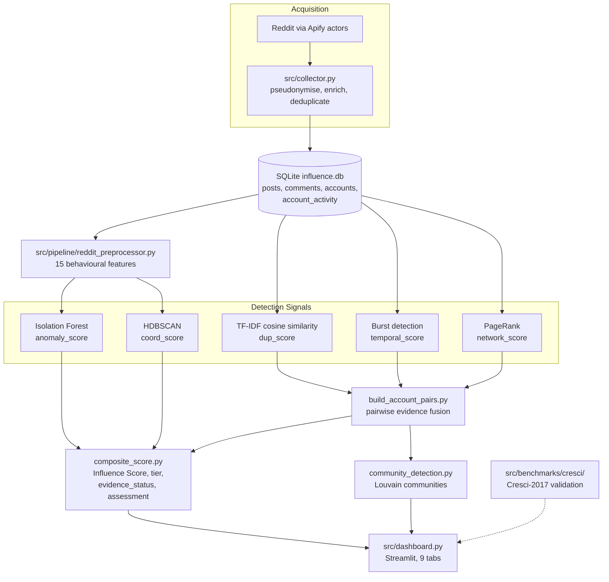

# Coordinated Influence Detector

**Detection of Coordinated Influence Amplification on Social Media Using Behavioural, Content and Network Analysis**


> An end-to-end research system that identifies **coordinated influence amplification** — networks of
> accounts that behave as a group rather than as independent users — in Nepali political discourse on
> Reddit. The system fuses five independent detection signals (behavioural anomaly, behavioural
> clustering, content duplication, temporal synchronisation and network centrality) into a single
> calibrated **Influence Score**, and reports the *evidence* behind every score rather than an
> unexplained verdict.

---

## Table of Contents

1. [Overview](#1-overview)
2. [System Architecture](#2-system-architecture)
3. [Detection Methodology](#3-detection-methodology)
4. [Benchmark Validation](#4-benchmark-validation-cresci-2017)
5. [Repository Structure](#5-repository-structure)
6. [Installation](#6-installation)
7. [Usage](#7-usage)
8. [Data and Database Schema](#8-data-and-database-schema)
9. [Configuration Reference](#9-configuration-reference)
10. [Ethics, Privacy and Responsible Use](#10-ethics-privacy-and-responsible-use)
11. [Known Limitations and Open Items](#11-known-limitations-and-open-items)
12. [Testing](#12-testing)
13. [Deployment](#13-deployment)
14. [Project Team](#14-project-team)
15. [License and Citation](#15-license-and-citation)

---

## 1. Overview

### 1.1 Problem Statement

Coordinated influence operations do not rely on individually suspicious accounts. They rely on
*ordinary-looking* accounts acting in concert — posting near-identical text, activating within the same
narrow time windows, and amplifying each other's reach. Any single account in such a network can pass a
per-account bot check. The coordination is only visible in the relationships **between** accounts.

This project therefore treats coordination as a **pairwise and group-level** property, not an account-level
label, and requires *converging independent evidence* before elevating an account's assessment.

### 1.2 What the System Does

| Capability | Implementation |
|---|---|
| Collects Reddit posts, comments and account metadata | `src/collector.py` via the Apify platform |
| Pseudonymises every account at ingestion time | SHA-256 digest, truncated; raw usernames never enter the database |
| Derives 15 behavioural features per account | `src/pipeline/reddit_preprocessor.py` |
| Runs five independent detection signals | `src/models/` |
| Fuses pairwise evidence with a convergence rule | `src/models/build_account_pairs.py` |
| Computes a coverage-calibrated composite score | `src/pipeline/composite_score.py` |
| Detects coordinated communities on the evidence graph | `src/models/community_detection.py` |
| Validates the approach against a labelled benchmark | `src/benchmarks/cresci/` (Cresci-2017) |
| Presents findings and per-account evidence | `src/dashboard.py` (Streamlit, 9 tabs) |

### 1.3 Study Domain

| Parameter | Value |
|---|---|
| Platform | Reddit |
| Communities | `r/Nepal`, `r/NepaliPolitics`, `r/nepalinews`, `r/NepalSocial` |
| Topic filter | Nepali political discourse (elections, government, parliament, policy, protest) |
| Collection target | 8,000 posts / 1,500 accounts (minimum acceptance: 5,000 / 1,000) |
| Ground truth | None available for Reddit — validation is performed on an external labelled benchmark |

### 1.4 Guiding Design Principle

**The system reports evidence, not intent.** No component in this repository claims to prove that a
group of accounts is a deliberate influence operation. Every output is framed as a strength-of-evidence
statement, and the vocabulary is deliberately hedged (`weak_support`, `supported`, `strong_support`;
`likely_organic` … `likely_coordinated_influence`). Three specific safeguards enforce this:

- **Missing evidence is never treated as absence of coordination.** Weights are renormalised over
  available signals, and a coverage factor penalises low-evidence scores.
- **Weak evidence types are capped.** Network centrality alone can never exceed a pair score of `0.40`.
- **Insufficient data is a first-class outcome.** Accounts with fewer than two valid signals are labelled
  `insufficient_data` rather than being scored.

---

## 2. System Architecture



### 2.1 Layer Responsibilities

| Layer | Modules | Responsibility |
|---|---|---|
| Configuration | `src/config.py` | Single source of paths, model parameters, collection targets; fail-fast validation |
| Persistence | `src/db.py` | 17-table schema, indexes, additive schema migration, WAL connection tuning |
| Acquisition | `src/collector.py`, `src/utils/` | Apify orchestration, pseudonymisation, enrichment, deduplication |
| Feature engineering | `src/pipeline/reddit_preprocessor.py` | Behavioural feature vector per account |
| Detection | `src/models/` | Five independent signals, evidence fusion, community detection |
| Scoring | `src/pipeline/composite_score.py` | Coverage-calibrated composite score and classification vocabulary |
| Orchestration | `src/run_pipeline.py` | Nine-step dependency-ordered execution |
| Presentation | `src/dashboard.py` | Streamlit analyst interface |
| Validation | `src/benchmarks/` | Cresci-2017 supervised benchmark and ablation studies |
| Diagnostics | `src/tools/` | Preflight checks, distribution audits, per-account explainability |

---

## 3. Detection Methodology

### 3.1 Behavioural Feature Extraction

`src/pipeline/reddit_preprocessor.py` computes 15 features per account into the `features` table.

<details>
<summary><b>Full feature list</b></summary>

| Feature | Description |
|---|---|
| `age_days` | Account age in days at time of analysis |
| `posts_per_day` | Submission rate |
| `comments_per_day` | Comment rate |
| `comment_ratio` | Comments as a fraction of all activity |
| `karma_score` | `comment_karma + link_karma` |
| `avg_score` | Mean score across the account's content |
| `subreddit_count` | Distinct subreddits the account is active in |
| `active_days` | Distinct days with recorded activity |
| `hour_entropy` | Shannon entropy of posting hour, normalised by `log2(24)`; low values indicate a mechanical schedule |
| `duplicate_ratio` | Self-duplication rate by `content_hash` |
| `avg_post_interval` | Mean seconds between submissions (`NULL` if fewer than 2) |
| `avg_comment_interval` | Mean seconds between comments (`NULL` if fewer than 2) |
| `night_activity_ratio` | Share of activity in hours 00:00–05:59 UTC |
| `burstiness_score` | Goh–Barabási burstiness `B = (σ − μ) / (σ + μ)` over inter-event gaps (`NULL` if fewer than 3 events) |
| `engagement_rate` | Mean score per item |

</details>

### 3.2 The Five Detection Signals

| # | Signal | Algorithm | Key Parameters | Output |
|---|---|---|---|---|
| 1 | **Behavioural anomaly** | Isolation Forest over all 15 features, standard-scaled | `n_estimators=100`, `contamination=0.1`, `random_state=42` | `scores.anomaly_score` (normalised, inverted so higher = more anomalous) |
| 2 | **Behavioural clustering** | HDBSCAN over 7 activity-shape features | `min_cluster_size=3`, `min_samples=2`; eligibility gate: `active_days ≥ 3`, activity rate ≥ 0.01, burstiness present | `scores.coord_score`, `scores.cluster_id` |
| 3 | **Content duplication** | TF-IDF + `NearestNeighbors(cosine)` across posts and comments | `COSINE_THRESHOLD=0.80`, min length 20 chars / 8 words, `[deleted]`/`[removed]` excluded | `content_similarity`, `scores.dup_score`, `coordination_events` |
| 4 | **Temporal synchronisation** | Repeated-burst detection per account pair | 600 s burst window, ≥3 accounts and ≥3 activities per burst, ≥2 bursts per pair, ≥1800 s burst separation | `temporal_similarity`, `coordination_events`, `scores.temporal_score` |
| 5 | **Network centrality** | PageRank over the directed reply graph | Run twice: whole-activity and topic-scoped | `edges`, `scores.network_score`, `scores.network_score_topic_scoped` |

Two design decisions are worth highlighting for review:

**HDBSCAN does not force sparse accounts into clusters.** Three states are distinguished explicitly, so
"not enough data" is never silently reported as "not coordinated":

| State | `coord_score` | Meaning |
|---|---|---|
| Ineligible | `NULL` | Too little activity to cluster meaningfully |
| Analysed, noise | `0.0` | Clustered and found not to belong to any group |
| Analysed, clustered | `> 0` | Member of a behavioural cluster (normalised cluster persistence) |

**Temporal coordination requires repetition, not a single coincidence.** A pair must co-occur in at least
two bursts separated by at least 30 minutes. Pair similarity is:

```
temporal_similarity = 0.50 · repetition + 0.30 · avg_burst_strength + 0.20 · avg_subreddit_overlap
where repetition = log1p(burst_count) / log1p(5)
```

A second, stricter content detector (`reddit_content_coordination.py`) applies a two-tier rule per
subreddit: either repeated similarity ≥ 0.85 across ≥ 2 occurrences, or a single very strong match
(≥ 0.98 similarity, ≥ 100 characters, within 24 hours).

### 3.3 Pairwise Evidence Fusion

`src/models/build_account_pairs.py` combines content, temporal and network evidence for each account pair.
Rather than averaging, it applies a **convergence rule**: independent evidence sources that agree are
rewarded, and single-source evidence is discounted according to how much weight that source can bear
alone.

```
base = 0.45 · content + 0.40 · temporal + 0.15 · network      (weights intentionally not renormalised)
```

| Evidence sources present | Adjustment | Rationale |
|---|---|---|
| Network only | `base × 0.45`, then **capped at 0.40** | Reply centrality is the weakest indicator; it cannot alone produce a strong pair |
| Temporal only | `base × 0.65` | Synchronisation without shared content is suggestive, not conclusive |
| Content only | `base × 0.75` | Strongest single-source indicator |
| Two sources | `base × 1.10 + 0.15` | Explicit convergence bonus |
| Three sources | `base × 1.20 + 0.25` | Full convergence bonus |

The result is clamped to `[0, 1]` and stored as `account_pairs.final_score`. Network evidence is itself
decomposed into volume (0.35), reciprocity (0.30) and concentration (0.35) sub-scores, each persisted for
audit.

### 3.4 Composite Influence Score

`src/pipeline/composite_score.py` produces the final per-account score from five signals:

| Signal | Weight |
|---|---|
| Behavioural anomaly | 0.30 |
| Behavioural coordination (HDBSCAN) | 0.25 |
| Temporal synchronisation | 0.20 |
| Content duplication | 0.15 |
| Network centrality | 0.10 |

Missing signals are **not** substituted with zero. Weights are renormalised over the signals actually
available, and the result is then multiplied by a coverage factor that penalises thin evidence:

```
influence_score = 100 × ( Σ wᵢ·sᵢ / Σ wᵢ ) × coverage(n)      for available signals i

coverage(n):  n=0 → 0.00   n=1 → 0.50   n=2 → 0.70
              n=3 → 0.85   n=4 → 0.95   n=5 → 1.00
```

An account with a single available signal can therefore never exceed 50 — a structural guard against
confident conclusions drawn from one weak observation.

### 3.5 Classification Vocabulary

Four independent labels are written per account, so that score, evidence quality and interpretation
remain separable.

**Tier** — derived from the score, but gated on evidence:

| Tier | Condition |
|---|---|
| `insufficient_data` | Fewer than 2 valid signals, or score undefined |
| `organic` | Score ≤ 30 |
| `coordinated` | Score > 60 **and** direct coordination evidence exists |
| `suspicious` | Otherwise |

Note that a high score alone is not sufficient for the `coordinated` tier; corroborating direct evidence
is required.

**Evidence status** — how well the coordination claim is supported:
`insufficient_data` → `no_direct_evidence` → `weak_support` → `supported` → `strong_support`

**Assessment** — the human-readable interpretation (7 values):
`insufficient_data`, `likely_organic`, `organic_with_coordination_pattern`, `suspicious`,
`suspicious_with_coordination_evidence`, `high_priority_coordinated_pattern`,
`likely_coordinated_influence`

**Confidence level** — driven purely by signal coverage:
`high` (≥ 4 signals), `medium` (3), `low` (2), `insufficient` (< 2)

### 3.6 Community Detection

`community_detection.py` runs Louvain community detection (`seed=42`, with a greedy-modularity fallback)
on the **fused evidence graph**, not on raw interaction edges — so communities are defined by shared
coordination evidence rather than by ordinary conversation. Edges qualify at `final_score ≥ 0.30` and must
carry either two or more evidence sources or very strong content-only evidence (≥ 0.95). Minimum community
size is 2. `community_validator.py` then classifies each community's evidence strength and composition
(read-only; console report).

---

## 4. Benchmark Validation (Cresci-2017)

Because no ground-truth labels exist for Reddit political discourse, the detection approach is validated
against the **Cresci-2017** labelled dataset of genuine accounts and nine categories of automated accounts.

| Aspect | Detail |
|---|---|
| Dataset groups | `genuine_accounts` (label 0); `fake_followers`, `social_spambots_1–3`, `traditional_spambots_1–4` (label 1) |
| Split | Account-level stratified 70 / 15 / 15 train / validation / test, `random_state=42`, persisted to `benchmark_splits` with explicit leakage assertions |
| Feature set | 40 features — 35 behavioural/profile features plus 5 temporal coordination features (`train.py` asserts this count at runtime) |
| Final model | `RandomForestClassifier(n_estimators=300, min_samples_split=4, min_samples_leaf=2, class_weight="balanced", random_state=42)` inside a median-imputation pipeline |
| Decision threshold | Selected on the validation split by scanning `0.10 … 0.95` for maximum F1 — the test split is never used for tuning |
| Metrics | Accuracy, precision, recall, F1, ROC-AUC, computed at runtime and written to `outputs/cresci/final/cresci_final_metrics.json` |
| Acceptance target | ROC-AUC ≥ 0.80 |

The temporal coordination features used in the benchmark are the same *idea* applied later to Reddit,
which is what makes the benchmark result relevant to the production pipeline rather than a detached
exercise.

**Supporting analyses** (run separately from the main benchmark):

| Module | Purpose |
|---|---|
| `ablation.py` | RandomForest feature ablation across five temporal-feature subsets, to establish which features actually drive performance |
| `category_evaluation.py` | Per-category performance breakdown rather than one pooled figure |
| `isolation_forest_evaluation.py` | Unsupervised Isolation Forest evaluation with contamination measured from the training bot fraction and clamped to scikit-learn's valid range |

> **Reproducibility note.** No metric value is hardcoded anywhere in the benchmark code — all figures are
> computed at run time from the split persisted in the database. The project log records ROC-AUC ≈ 0.84
> for the behavioural anomaly detector against the ≥ 0.80 target; see
> [Known Limitations](#11-known-limitations-and-open-items) for the current status of the unsupervised
> configuration on the full 40-feature set.

---

## 5. Repository Structure

```
coordinated-influence-detector/
├── src/
│   ├── config.py                       # Central configuration and fail-fast validation
│   ├── db.py                           # 17-table schema, indexes, additive migration, WAL tuning
│   ├── collector.py                    # Reddit acquisition via Apify (6 collection modes)
│   ├── run_pipeline.py                 # Nine-step dependency-ordered orchestrator
│   ├── dashboard.py                    # Streamlit analyst interface (9 tabs)
│   │
│   ├── pipeline/
│   │   ├── reddit_preprocessor.py      # 15 behavioural features
│   │   └── composite_score.py          # Coverage-calibrated Influence Score
│   │
│   ├── models/
│   │   ├── reddit_isolation_forest.py  # Signal 1 — behavioural anomaly
│   │   ├── reddit_hdbscan.py           # Signal 2 — behavioural clustering
│   │   ├── reddit_cosine_similarity.py # Signal 3 — content duplication
│   │   ├── reddit_content_coordination.py # Signal 3 (strict two-tier variant)
│   │   ├── reddit_temporal_coordination.py # Signal 4 — repeated-burst synchronisation
│   │   ├── reddit_networkx.py          # Signal 5 — PageRank centrality
│   │   ├── build_account_pairs.py      # Pairwise evidence fusion
│   │   ├── community_detection.py      # Louvain on the evidence graph
│   │   ├── community_validator.py      # Community evidence classification (read-only)
│   │   ├── content_diagnostics.py      # Threshold support diagnostics
│   │   ├── content_threshold_sweep.py
│   │   ├── content_candidate_inspector.py
│   │   ├── inspect_account.py          # Single-account CLI dump
│   │   ├── isolationforest.py          # Legacy benchmark-facing Isolation Forest
│   │   └── update_coordination_evidence.py # Standalone pair-only diagnostic (see note below)
│   │
│   ├── benchmarks/
│   │   ├── cresci/                     # Active Cresci-2017 package
│   │   │   ├── database.py             # Build cresci-2017.db from raw CSVs
│   │   │   ├── split.py                # 70/15/15 stratified split with leakage checks
│   │   │   ├── features.py             # 35 base features
│   │   │   ├── temporal.py             # 7 temporal coordination features
│   │   │   ├── final_features.py       # Joined final feature table
│   │   │   ├── train.py                # RandomForest training and test evaluation
│   │   │   ├── category_evaluation.py  # Per-bot-category breakdown
│   │   │   ├── ablation.py             # Feature ablation study
│   │   │   └── isolation_forest_evaluation.py
│   │   └── legacy/                     # Superseded loaders and evaluators, retained for provenance
│   │
│   ├── tools/                          # Diagnostics and QA (see §7.4)
│   └── utils/anonymization.py          # Reusable pseudonymisation helpers
│
├── scripts/run_cresci.py               # Benchmark orchestrator
├── tests/                              # Unit tests
├── data/influence.db                   # Committed analysis database (see §8, §10)
├── requirements.txt                    # Full pipeline dependencies
├── src/requirements.txt                # Dashboard-only dependencies (deployment)
├── .streamlit/config.toml              # Dashboard theme
├── .env.example                        # Required environment variables
└── progresslog.md                      # Phase-by-phase development record
```

> **Note on `update_coordination_evidence.py`.** This module is deliberately excluded from
> `run_pipeline.py`. It recomputes `evidence_status` / `assessment` from `account_pairs` alone, without
> visibility into the content and temporal evidence in `coordination_events`, and was confirmed on real
> data to disagree with `composite_score.py` depending purely on execution order. It is retained as a
> manual, standalone diagnostic. The reasoning is documented inline in `src/run_pipeline.py`.

---

## 6. Installation

### 6.1 Prerequisites

| Requirement | Notes |
|---|---|
| Python 3.13 | The dashboard dependency set is pinned against Python 3.13.11 |
| Git | — |
| Apify account and API token | Required only for data collection, not for analysis or the dashboard |
| Cresci-2017 dataset | Required only to reproduce the benchmark; obtained from the dataset authors |

### 6.2 Setup

```bash
git clone https://github.com/Blopinpg1/coordinated-influence-detector.git
cd coordinated-influence-detector

python -m venv .venv
source .venv/bin/activate          # Windows: .venv\Scripts\activate

pip install -r requirements.txt
```

### 6.3 Environment Variables

Copy the template and provide an Apify token:

```bash
cp .env.example .env
```

```ini
APIFY_API_TOKEN=your_apify_api_token_here
```

| Variable | Required for | Purpose |
|---|---|---|
| `APIFY_API_TOKEN` | Data collection | Authenticates Apify actor runs |
| `ACCOUNT_MAP_PATH` | Optional | Overrides the location of the local, git-ignored username map |

`.env` is git-ignored. The token is only read when an actor is actually invoked, so analysis-only and
`--backfill` workflows run without it.

### 6.4 Verify the Installation

```bash
python -m src.tools.verify_setup
```

This preflight check reports the resolved project and database paths, validates the scoring weights,
confirms that all eight required third-party packages import, initialises the database schema, and lists
every table. It exits non-zero with a list of missing packages, or prints `Phase 0 setup check: PASS`.

---

## 7. Usage

### 7.1 Data Collection

All modules are executed from the repository root using `python -m`, since they rely on absolute `src.`
imports.

```bash
# Rank and print candidate accounts for review — no API calls, no cost
python -m src.collector --mode candidates

# Recent submissions and comments from the configured subreddits
python -m src.collector --mode recent --recent-posts 200 --recent-comments 20

# Historical keyword search within a date range
python -m src.collector --mode historical \
    --subreddit Nepal --keyword election \
    --start-date 2025-09-01 --end-date 2025-09-30 \
    --max-historical-jobs 5

# Deep per-account history for auto-selected candidates
python -m src.collector --mode accounts --account-limit 10 --account-posts 50

# Recompute topic, language and sentiment from stored text — no API calls
python -m src.collector --backfill
```

**Collection modes**

| Mode | Behaviour |
|---|---|
| `recent` | Scrapes `/new/` listings for each configured subreddit |
| `historical` | Keyword × subreddit search across a date range (default mode) |
| `accounts` | Deep post/comment history for auto-selected candidate accounts |
| `candidates` | Prints ranked candidate accounts for manual review; makes no API calls |
| `both` | `recent` + `historical` |
| `full` | `recent` + `historical` + account histories |

<details>
<summary><b>Complete collector flag reference</b></summary>

| Flag | Default | Purpose |
|---|---|---|
| `--mode` | `historical` | Collection mode (see above) |
| `--backfill` | off | Recompute enrichment from stored text, then exit |
| `--subreddit` | 4 configured subreddits | Repeatable; leading `r/` is stripped |
| `--keyword` | configured search terms | Repeatable historical keywords |
| `--start-date` / `--end-date` | none | `YYYY-MM-DD`, UTC, end-inclusive |
| `--recent-posts` / `--recent-comments` | 100 / 0 | Caps for a recent run |
| `--historical-posts` | 100 | Cap per historical job |
| `--historical-sorts` | `top` | From `relevance`, `hot`, `top`, `new`, `rising`, `comments` |
| `--historical-time` | `all` | `all`, `hour`, `day`, `week`, `month`, `year` |
| `--max-historical-jobs` | 0 (unlimited) | Primary cost control — truncates the job list |
| `--account-limit` | 30 | Maximum candidate accounts |
| `--candidate-min-posts` / `--candidate-min-topics` | 3 / 1 | Candidate qualification thresholds |
| `--account-posts` / `--account-comments` | 50 / 0 | Per-account history caps |
| `--account-post-sorts` / `--account-comment-sorts` | `new` | Sort orders for account history |
| `--account-time` | `all` | Time filter for account history |
| `--delay` | 2.0 | Seconds between account-history API calls |
| `--no-profiles` | off | Skip profile enrichment (karma, account age) |

All arguments are validated before any network call: date format and ordering, non-negative limits, and
minimum thresholds.

</details>

**Operational safeguards.** Profile enrichment is batched at 15 usernames with a 30-second pause between
batches, because Reddit rate-limits profile pages far more aggressively than subreddit listings. Accounts
that already have profile data are skipped entirely, so profiles are never re-fetched. Actor runs carry
retry counts and 15–30 minute timeouts, individual job failures are isolated rather than aborting the run,
and writes commit every 500 rows.

> Apify bills per result item. Begin with a small `--max-historical-jobs` or a two-account profile test
> before running at scale.

### 7.2 Analysis Pipeline

Run the full pipeline in dependency order:

```bash
python -m src.run_pipeline
```

The nine steps, in the order enforced by the orchestrator:

| Step | Module | Writes |
|---|---|---|
| 1 | `src.pipeline.reddit_preprocessor` | `features` |
| 2 | `src.models.reddit_isolation_forest` | `scores.anomaly_score` |
| 3 | `src.models.reddit_hdbscan` | `scores.coord_score`, `scores.cluster_id` |
| 4 | `src.models.reddit_cosine_similarity` | `content_similarity`, `scores.dup_score`, `coordination_events` |
| 5 | `src.models.reddit_content_coordination` | `content_similarity` |
| 6 | `src.models.reddit_temporal_coordination` | `temporal_similarity`, `coordination_events`, `scores.temporal_score` |
| 7 | `src.models.reddit_networkx` | `edges`, `communities.pagerank`, `scores.network_score*` |
| 8 | `src.models.build_account_pairs` | `account_pairs` |
| 9 | `src.pipeline.composite_score` | `scores.influence_score`, `tier`, `evidence_status`, `confidence_level`, `assessment` |

Steps 8 and 9 have hard ordering requirements: evidence fusion must follow all three pairwise evidence
producers, and the composite score must run last because it is the only component that observes content,
temporal and pair evidence together.

Community detection is **not** part of the automated pipeline and is run separately:

```bash
python -m src.models.community_detection
python -m src.models.community_validator
```

Individual steps can also be run on their own, for example:

```bash
python -m src.models.reddit_hdbscan
```

None of the model or pipeline modules take command-line arguments; their behaviour is controlled through
`src/config.py` and module-level constants.

### 7.3 Dashboard

```bash
streamlit run src/dashboard.py
```

The dashboard reads live values from the database and from saved benchmark output files — no figures are
hardcoded — and imports its weights and tiers directly from `composite_score.py` and `config.py` so it
cannot drift from the pipeline.

| Tab | Contents |
|---|---|
| Overview | Corpus summary, score distribution, tier and assessment breakdowns |
| Isolation Forest | Behavioural anomaly rankings and feature context |
| HDBSCAN | Behavioural clusters and eligibility states |
| Cosine Similarity | Near-duplicate content pairs |
| NetworkX | Reply-graph centrality, whole-activity and topic-scoped |
| Coordination Evidence | Fused pair evidence and coordination events |
| Investigate | Per-account drill-down |
| Cresci Benchmark | Benchmark metrics and ROC curve from saved output files |
| Data Coverage | Signal availability and collection completeness |

Run the analysis pipeline before the dashboard, so the scoring tables are populated.

### 7.4 Diagnostics and Explainability

| Command | Purpose |
|---|---|
| `python -m src.tools.verify_setup` | Preflight environment, dependency and schema check |
| `python -m src.tools.score_diagnostics` | Score and signal distributions, coverage, tier/assessment crosstabs, four consistency checks (read-only) |
| `python -m src.tools.pair_diagnostics` | Pair-level evidence distributions, coordination types, strongest pairs, most-connected accounts (read-only) |
| `python -m src.tools.evidence_inspector <ACCOUNT_ID>` | Full explainability report for one account: every signal, all supporting evidence, recent content, and interpretation caveats |
| `python -m src.models.inspect_account` | Alternative single-account CLI dump |
| `python -m src.models.content_diagnostics` | Verify that `COSINE_THRESHOLD` is actually supported by the dataset |
| `python -m src.models.content_threshold_sweep` | Threshold sensitivity sweep |
| `python -m src.tools.checkschema` / `debug_check` | Schema and database-path introspection |

The evidence inspector is the intended answer to "why did this account receive this score" — a
requirement for any system whose output could affect how a real account is perceived.

### 7.5 Reproducing the Benchmark

Build the benchmark database from the raw Cresci-2017 release, then run the orchestrator:

```bash
# One-time: build data/benchmarks/cresci-2017.db from the raw dataset
python -m src.benchmarks.cresci.database --dataset /path/to/cresci-2017

# Split, features, temporal features, final table, train, per-category evaluation
python scripts/run_cresci.py
```

`scripts/run_cresci.py` takes no arguments. It runs `split` → `features` → `temporal --window 5` →
`final_features` → `train` → `category_evaluation`, writing to `outputs/cresci/final/`. Training is
skipped if `cresci_final_model.joblib` already exists, so re-running will not silently overwrite a
recorded result; pass `--overwrite` to the module directly to retrain deliberately.

Supporting analyses are run separately:

```bash
python -m src.benchmarks.cresci.ablation
python -m src.benchmarks.cresci.isolation_forest_evaluation
```

The benchmark expects the standard Cresci-2017 layout, in which each source group is a directory
(`genuine_accounts.csv/`, `social_spambots_1.csv/`, …) containing `users.csv` and `tweets.csv`. The loader
searches recursively, so the nested variants of the official release are handled.

### 7.6 Merging Independently Collected Databases

Team members can collect in parallel and merge afterwards. Because account identifiers are deterministic
hashes, the same account resolves to the same identifier across every collector's database.

```bash
python -m src.tools.merge_databases master.db teammate_a.db teammate_b.db
```

Only raw tables are merged (`accounts`, `posts`, `comments`, `dataset_metadata`); `account_activity` and
account totals are rebuilt, and all derived tables are cleared so that every score is recomputed from the
merged corpus rather than being carried over inconsistently. Re-run `python -m src.run_pipeline`
afterwards.

> Merges are positional `INSERT ... SELECT` operations, so all source databases must be on the same
> schema version. Run `python -m src.tools.verify_setup` on each before merging.

To rebuild from scratch:

```bash
python -m src.tools.reset_db      # deletes the database file at the configured path
```

---

## 8. Data and Database Schema

### 8.1 Current Corpus

The committed `data/influence.db` snapshot contains:

| Table | Rows | Table | Rows |
|---|---|---|---|
| `posts` | 3,360 | `edges` | 3,701 |
| `comments` | 3,067 | `account_pairs` | 668 |
| `accounts` | 3,145 | `coordination_events` | 179 |
| `account_activity` | 6,757 | `temporal_similarity` | 85 |
| `features` | 3,111 | `content_similarity` | 1 |
| `scores` | 3,145 | `dataset_metadata` | 283 |

This is below the 5,000-post / 1,000-account acceptance minimum for posts and above it for accounts;
collection is the phase still in progress. The single `content_similarity` row is consistent with the
open item described in [§11](#11-known-limitations-and-open-items).

### 8.2 Schema

<details>
<summary><b>All 17 tables</b></summary>

| Table | Purpose |
|---|---|
| `posts` | Raw submissions: text, `content_hash`, timestamps, score, and enrichment (`topic`, `topic_score`, `sentiment`, `language`, `is_relevant`) |
| `comments` | Raw comments, plus `post_id` and `parent_id` for thread structure |
| `accounts` | One row per pseudonymised account; `username` is always `NULL`; `created_utc`, karma, denormalised totals |
| `account_activity` | Flattened per-action timeline used by temporal analysis; unique across all four columns |
| `features` | Engineered 15-feature behavioural vector per account |
| `edges` | Directed interaction graph keyed by `(source, target, edge_type)` |
| `content_similarity` | Pairwise content similarity with the `method` that produced it |
| `temporal_similarity` | Pairwise temporal synchronisation similarity and average time difference |
| `account_pairs` | Fused pair evidence: content/temporal/network scores, network sub-scores, `final_score`, `coordination_type` |
| `communities` | Per-account community assignment, centrality, PageRank, coordination strength |
| `scores` | Final per-account output: five signal scores, `influence_score`, `tier`, `cluster_id`, `evidence_status`, `confidence_level`, `assessment` |
| `coordination_events` | Individual discrete evidence events between two accounts |
| `predictions` | Supervised model output per account |
| `dataset_metadata` | One row per collection call: date, subreddits, counts, actor/mode provenance |
| `model_metrics` | Evaluation metrics per model run |
| `experiments` | Experiment tracking: model, JSON parameters, scores |
| `collection_runs` | Per-run collection audit log (defined and indexed; provenance is currently recorded in `dataset_metadata`) |

Approximately 30 indexes are created alongside these tables.

</details>

**Schema migration.** `CREATE TABLE IF NOT EXISTS` never alters an existing table, so `_migrate_schema()`
inspects `PRAGMA table_info` for each evolving table and idempotently adds any missing column, logging
`[DB MIGRATION] Adding <table>.<column>`. Existing databases therefore evolve in place as new signals are
added, instead of requiring a manual rebuild. The mechanism is additive only — it does not drop, rename,
retype or backfill.

**Connection tuning.** `get_conn()` enables `foreign_keys`, `journal_mode=WAL`, `synchronous=NORMAL` and a
60-second `busy_timeout`, which is what allows the dashboard to read while a collection run writes.

---

## 9. Configuration Reference

All tunable parameters live in `src/config.py`, and `ensure_runtime_ready()` validates them before any
work begins — scoring weights must sum to 1.0, Isolation Forest contamination must lie in `(0, 0.5]`,
HDBSCAN parameters must be structurally valid, and the cosine threshold must lie in `(0, 1]`.

| Setting | Default | Environment override |
|---|---|---|
| `DATA_DIR` | `./data` | `DATA_DIR` |
| `OUTPUTS` | `./outputs` | `OUTPUTS_DIR` |
| `BENCHMARK_DB_PATH` | `./data/benchmark.db` | `BENCHMARK_DB_PATH` |
| `ISOLATION_FOREST.n_estimators` | 100 | `IF_N_ESTIMATORS` |
| `ISOLATION_FOREST.contamination` | 0.24 | `IF_CONTAMINATION` |
| `ISOLATION_FOREST.random_state` | 42 | `IF_RANDOM_STATE` |
| `HDBSCAN_PARAMS.min_cluster_size` | 3 | `HDBSCAN_MIN_CLUSTER_SIZE` |
| `HDBSCAN_PARAMS.min_samples` | 2 | `HDBSCAN_MIN_SAMPLES` |
| `COSINE_THRESHOLD` | 0.80 | `COSINE_THRESHOLD` |
| `REDDIT_COLLECTION` | 4 subreddits, 9 search terms, targets 8000/1500 | — |

Two dependency files are maintained deliberately:

| File | Scope |
|---|---|
| `requirements.txt` | Full pipeline: collection, analysis and benchmarks. Source of truth for local work. |
| `src/requirements.txt` | Dashboard only, hard-pinned. Streamlit Community Cloud resolves the entry point's directory first, so this file governs the deploy and avoids building pipeline-only native dependencies the dashboard never imports. |

If a new import is added to `dashboard.py`, it must be added to **both** files.

---

## 10. Ethics, Privacy and Responsible Use

This system analyses the public behaviour of real people. The following measures are structural, not
advisory.

### 10.1 Pseudonymisation

Usernames are hashed with SHA-256 and truncated to 16 hexadecimal characters at ingestion. The
`accounts.username` column is **always written as `NULL`** — there is no configuration flag that can cause
raw usernames to be stored in the database. Hashing is deterministic after normalisation
(`strip().lower()`), which is what allows independently collected databases to be merged.

Account-history collection requires the original username, so a reverse map is written to a local
`.account_map.json` (override with `ACCOUNT_MAP_PATH`). This file:

- is listed in `.gitignore`, and the collector additionally appends it to `.gitignore` on first write;
- is read only by account-history mode;
- is never uploaded and never surfaced in the dashboard.

> **Stated plainly:** truncated, unsalted SHA-256 of a public username is **pseudonymisation, not
> anonymisation**. A dictionary attack over a list of Reddit usernames can reverse it. It removes casual
> identifiability from the stored dataset; it is not a cryptographic privacy guarantee. Treat the database
> as containing personal data.

### 10.2 The Committed Database

`.gitignore` excludes `data/*` but deliberately re-includes `data/influence.db`, so that the deployed
dashboard has a database to read. Account identifiers in it are pseudonymised, but **raw post and comment
text is not**. Committing this file therefore publishes that text to anyone who can read the repository.
Keep the deployed application unlisted if that matters for your review context, and consider whether the
database should be committed at all for a public release.

### 10.3 Interpretive Limits

- The system produces **evidence of coordination**, never proof of intent, and the output vocabulary is
  hedged accordingly.
- Coordinated behaviour is not inherently malicious. Activists, fan communities, news aggregators and
  brigading all produce similar signatures.
- `insufficient_data` is a genuine outcome. Low activity must not be read as innocence, and it must not be
  read as guilt.
- Outputs are intended for research analysis and further human review, not for automated enforcement,
  moderation action, or any public accusation against an identifiable account.
- Data collection is limited to publicly visible content and respects the platform intermediary's rate
  limits.

---

## 11. Known Limitations and Open Items

Recorded here in the interest of methodological transparency; tracked in `progresslog.md`.

**Methodological**

1. **Two content-similarity implementations write to the same table.**
   `reddit_cosine_similarity.py` and `reddit_content_coordination.py` both populate
   `content_similarity`, and the latter clears the table before inserting its own stricter results. In the
   pipeline's execution order the stricter detector's output is what survives, which is why the committed
   snapshot holds a single row. The per-account `scores.dup_score` written by the cosine detector is
   unaffected. This must be resolved to a single authoritative detector before final results are reported.
2. **Unsupervised anomaly detection on the full benchmark feature set is not the reported benchmark
   result.** The supervised RandomForest is the final benchmark model. The Isolation Forest evaluation on
   the 40-feature Cresci set did not reproduce the ≥ 0.80 target — a documented finding, and the reason
   the supervised model is used for validation. The ≈ 0.84 figure recorded in `progresslog.md` refers to
   the behavioural anomaly detector on its own smaller feature configuration and should be re-derived and
   cited from a captured metrics file rather than from the log.
3. **No missing-value imputation for unresolved profiles.** Where profile enrichment never resolves,
   `age_days` and `karma_score` remain absent. The handling policy is an open decision.
4. **No ground truth for Reddit.** Reddit results are unsupervised and cannot be reported with accuracy or
   AUC; the benchmark is the only quantitative validation.

**Configuration consistency**

5. `config.py` defines `WEIGHTS` (four signals), but the pipeline uses `COMPOSITE_WEIGHTS` (five signals)
   in `composite_score.py`. The five-signal weights documented in §3.4 are the ones that run;
   `config.WEIGHTS` is not on the composite path and should be reconciled or removed.
6. `reddit_isolation_forest.py` uses a module-level `contamination = 0.1`; `config.ISOLATION_FOREST`
   specifies `0.24`. The module value is what executes.
7. `config.TIERS` states numeric bands `31–60` and `61–100`, but runtime tiering uses `≤ 30` for
   `organic` and `> 60` **plus direct evidence** for `coordinated`. §3.5 documents the runtime behaviour.
8. `db.py` overrides the imported `DB_PATH` with a hardcoded `data/influence.db`, so `INFLUENCE_DB_PATH`
   does not take effect for `get_conn()` / `init_db()` even though `config.py` and `reset_db.py` honour it.
   Do not rely on that override; `merge_databases.py` is affected when the master database is not at the
   default path.
9. `src/utils/anonymization.py` documents the intended pseudonymisation interface but is not imported
   anywhere; `collector.py` uses an equivalent local implementation. The two should be consolidated.
10. `reset_db.py` performs deletion at import time and removes only the `.db` file, not the WAL sidecars.

**Data quality**

11. Language classification is reliable only for English and Devanagari-script Nepali.
12. VADER sentiment is English-only and returns `0.0` for Nepali text, which is indistinguishable from
    genuinely neutral sentiment.
13. `posts.edited` / `comments.edited` are always `0` — the upstream actor does not expose the field.
14. `dataset_metadata.notes` records the primary actor for every row, so rows produced by the historical
    search actor are attributed to the wrong actor.
15. Historical comment collection is forced to zero regardless of the requested limit.

---

## 12. Testing

```bash
pytest tests/
```

The current suite covers the contamination-resolution helper in the benchmark's Isolation Forest
evaluation, verifying that a measured bot fraction above 0.5 is clamped to scikit-learn's valid upper
bound and that in-range values pass through unchanged. Coverage is intentionally narrow; the read-only
diagnostic tools in `src/tools/` carry the majority of the project's verification burden, including four
automated score/assessment consistency checks in `score_diagnostics.py`.

---

## 13. Deployment

The dashboard is deployable to Streamlit Community Cloud:

| Setting | Value |
|---|---|
| Entry point | `src/dashboard.py` |
| Python version | 3.13 |
| Dependencies | resolved from `src/requirements.txt` (hard-pinned, dashboard-only) |
| Data source | the committed `data/influence.db`, opened read-only |
| Theme | `.streamlit/config.toml`, matched to the dashboard's own CSS variables |

Review [§10.2](#102-the-committed-database) before deploying publicly.

---

## 14. Project Team

**Detection of Coordinated Influence Amplification on Social Media Using Behavioural, Content and Network
Analysis** — minor project.

| Member |
|---|
| Abhinash Kumar Yadav |
| Abhisek Karki |
| Bibek Oli |
| Kaushal Adhikari |

Development history, phase-by-phase status, design decisions and the reasoning behind each deliberate
scope extension are recorded in [`progresslog.md`](progresslog.md).

### Scope Extensions Beyond the Original Proposal

Three components were added deliberately during development and are documented as methodological
contributions rather than incidental additions:

1. **Temporal coordination detection** — repeated-burst analysis, applied to both the Reddit corpus and
   the benchmark dataset.
2. **Pairwise evidence fusion with a convergence rule** — rewarding agreement between independent evidence
   sources instead of averaging them, and capping what weak evidence can conclude alone.
3. **Community detection on the fused evidence graph** — identifying coordinated groups rather than only
   coordinated pairs.

---

## 15. License and Citation

This repository does not currently include a license file. All rights are reserved by the authors pending
institutional guidance; please contact the project team before reuse or redistribution.

The Cresci-2017 dataset is the property of its original authors and is subject to their terms. It is not
redistributed here and must be obtained separately.

If you reference this work, please cite it as:

```bibtex
@misc{coordinated_influence_detector,
  title  = {Detection of Coordinated Influence Amplification on Social Media
            Using Behavioural, Content and Network Analysis},
  author = {Yadav, Abhinash Kumar and Karki, Abhisek and Oli, Bibek and Adhikari, Kaushal},
  year   = {2026},
  note   = {Minor project},
  url    = {https://github.com/Blopinpg1/coordinated-influence-detector}
}
```
